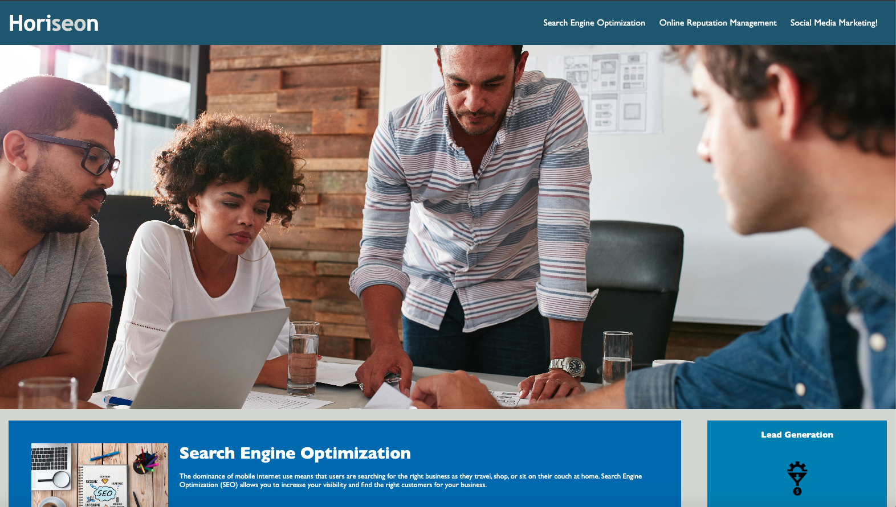

# challenge1SEO

* [Description](#description)
* [Purpose](#purpose)
* [Usage](#usage)
* [Credits](#credits)
* [Screenshots](#screenshots)
* [License](#license)

## Description
The code was created in hopes to make the website more accesible for visually impaired internet users. I built this project to help the internet and navigation more straight forward for the impaired community. It's important to understand the code required but more important to create it around and all types of people that will be ultimately using it.

## Purpose
The purpose of the edit was to introduce accesibility features into the code for those with visual impairement.

## Usage
Open index.html in any browser. Navigate the website using voice over.

## Credits
Base code before refactor from edX website (https://courses.bootcampspot.com/courses/3016/assignments/44711?module_item_id=831919#getting-started)

## Screenshots

## License
MIT license - included in LICENSE